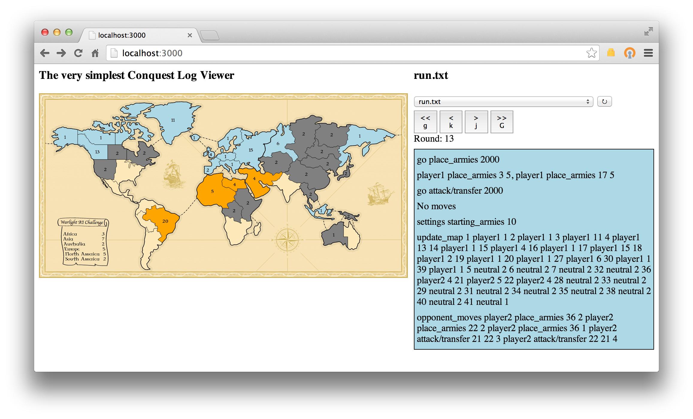

# Extremely simple Conquest viewer

This is a viewer for the Conquest AI game at [http://theaigames.com/](http://theaigames.com/).

## Prerequisites

* Node.js
* To get started, run `npm install` from the app's directory.

## How to use

* Obtain log files from the game you want to view (only perspective from one
  player supported), put them in the `logs/` directory.
* `node viewer.js` from the app's directory.
* Open a browser to `http://localhost:3000`.

## Welp

The only guarantee you get is that this product will take up space on your
drive!

I only built it in a couple of hours, and there's features missing and probably
a bunch of edge cases I missed. If you feel strongly about this, pull requests
are welcome ;).
